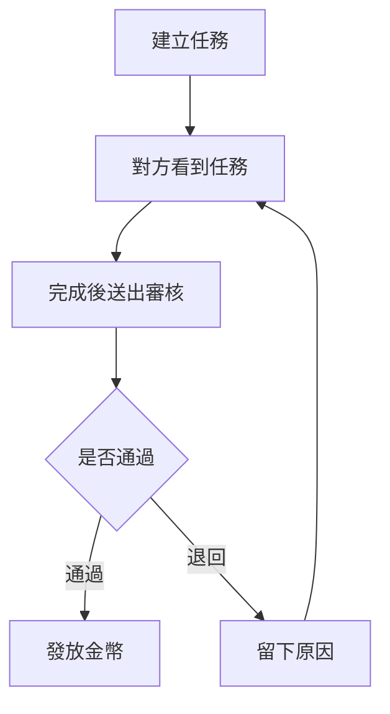
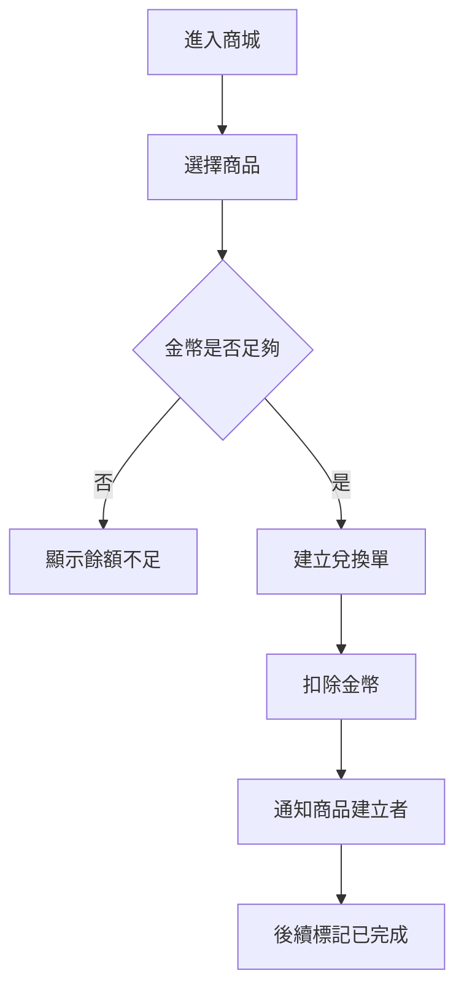

# Couple PWA Plan

## 1. 產品定位

這不是一般的待辦清單，也不是情侶打卡遊戲。

它比較像一個只屬於兩個人的小系統，把平常那些說出口的請託、答應彼此的事、做完後想被看見的付出，整理成一條很清楚的流程：

1. 一方發任務
2. 另一方完成
3. 發起方審核
4. 通過後得到金幣
5. 金幣再去商城兌換對方承諾的獎勵

重點不是管人，而是把互相照顧這件事，做得有回應、有記錄，也有一點儀式感。

## 2. 產品目標

### 核心目標

- 讓瑣事不那麼像瑣事
- 讓「我有做到」和「我有看見」都有明確回應
- 讓金幣成為你們之間自己的交換語言
- 讓商城像承諾清單，不像廉價的遊戲獎勵

### 第一版先不要做

- 群組模式
- 聊天功能
- 動態牆
- 排行榜
- AI 助手
- 很複雜的成就系統

第一版只做最有力量的主循環。

## 3. 產品原則

- 只服務兩個人
- 所有資料都以情侶空間為單位
- 每一次金幣增減都要可追溯
- 審核規則要清楚，避免模糊地帶
- 視覺要克制，不能做成可愛任務 App
- 技術選型要以零預算、低維護成本為前提

## 4. MVP 功能範圍

### 4.1 帳號與綁定

使用者可以：

- 用 Email + Password 註冊
- 設定暱稱、頭像
- 產生邀請碼或邀請連結
- 與一位對象綁定成一對

規則：

- 一個帳號只能屬於一個情侶空間
- 綁定完成後，所有任務、商城、金幣資料都只在該空間內流動

### 4.2 任務系統

每筆任務包含：

- 標題
- 描述
- 金幣數值
- 指派對象
- 發起人
- 截止日
- 狀態
- 建立時間

建議狀態先收斂成：

- `open` 待完成
- `submitted` 待審核
- `approved` 已通過
- `rejected` 已退回
- `cancelled` 已取消

這樣比較夠用，也比較乾淨。

因為只有兩個人，所以第一版不需要「待領取」這種認領機制，直接指派就好。

### 4.3 審核機制

流程建議如下：

- 執行方完成後按下「送出審核」
- 發起方看到待審核項目
- 發起方可以選擇「通過」或「退回」
- 若退回，必須留一句原因

通過後：

- 任務改為 `approved`
- 系統新增一筆金幣流水
- 執行方餘額增加

退回後：

- 任務改為 `rejected`
- 不發金幣
- 執行方可再修改後重新送審

### 4.4 金庫與流水

首頁或金庫頁要看得到：

- 我的目前餘額
- 對方的目前餘額
- 最近金幣紀錄

流水欄位至少要有：

- 類型
- 金額
- 來源類型
- 來源 ID
- 說明文字
- 建立時間

流水類型建議：

- `task_reward`
- `shop_redeem`
- `manual_adjustment`

第一版不要直接改餘額數字，所有變動都走流水，後端再做安全計算。

### 4.5 商城

商城的概念不是賣東西，而是「由對方提供可兌換的承諾」。

商品欄位：

- 名稱
- 描述
- 價格
- 分類
- 是否上架
- 是否為隱藏商品
- 可選的數量限制

範例：

- 幫你按摩 30 分鐘
- 一次免洗碗
- 今晚電影你選
- 週末帶你去海邊

### 4.6 隱藏商城

這個點子很對，因為它會讓商城多一層私密感。

我建議不要做成「狂點底部商城按鈕六次」，那種很容易誤觸，也有點廉價。

比較好的方式：

- 進入商城頁
- 連點頁面標題六次
- 顯示隱藏商城入口或直接展開隱藏區塊

這樣比較像刻意留給彼此的小暗號。

### 4.7 兌換單

按下兌換後，不應該只是扣金幣然後結束。

比較合理的是建立一張兌換單，讓這份承諾也有後續狀態。

建議狀態：

- `redeemed` 已兌換
- `in_progress` 準備履行
- `fulfilled` 已完成
- `cancelled` 已取消

這樣商城才不會變成單向扣款紀錄，而是真的有被兌現。

## 5. 頁面架構

底部導覽建議就是五個：

- 首頁
- 任務
- 商城
- 金庫
- 設定

### 首頁

首頁不要做成展示頁，直接進功能。

建議內容：

- 我的餘額
- 對方餘額
- 等我完成的任務
- 等我審核的任務
- 最新兌換紀錄

首頁的角色應該像一個安靜的總覽，不要塞太多東西。

### 任務頁

分成四區最剛好：

- 指派給我的
- 我建立的
- 待我審核
- 已完成紀錄

### 商城頁

建議分三區：

- 可兌換商品
- 我建立的商品
- 兌換紀錄

### 金庫頁

- 目前餘額
- 流水紀錄
- 依收入 / 支出篩選

### 設定頁

- 頭像與暱稱
- 綁定資訊
- 視覺細節設定
- 登出

## 6. 主要流程

### 6.1 任務流程

### 6.2 商城兌換流程

## 7. 產品規則

這幾條最好一開始就定死。

### 任務規則

- 發起人不能自己審核自己
- 任務一旦送審，金幣數值鎖定
- 只有送審前可以取消
- 被退回的任務，重新送審時仍沿用原本金額
- 同一筆任務不可重複發幣

### 商城規則

- 商品改價只影響未來的新兌換
- 已兌換訂單保留當時價格快照
- 商品下架不影響舊紀錄
- 隱藏商品本質上只是 `is_hidden = true`

### 情侶空間規則

- 所有資料都要帶 `couple_id`
- 不在同一個 `couple_id` 的資料絕對不能互相讀到

## 8. 資料表設計

建議先用這幾張表：

### `profiles`

- `id`
- `email`
- `nickname`
- `avatar_url`
- `created_at`

### `couples`

- `id`
- `created_at`

### `couple_members`

- `id`
- `couple_id`
- `user_id`
- `role`
- `joined_at`

### `invite_codes`

- `id`
- `created_by`
- `code`
- `expires_at`
- `used_at`

### `tasks`

- `id`
- `couple_id`
- `creator_id`
- `assignee_id`
- `title`
- `description`
- `coin_reward`
- `due_at`
- `status`
- `submitted_at`
- `approved_at`
- `cancelled_at`
- `created_at`
- `updated_at`

### `task_reviews`

- `id`
- `task_id`
- `reviewer_id`
- `decision`
- `comment`
- `created_at`

### `ledger_entries`

- `id`
- `couple_id`
- `user_id`
- `entry_type`
- `amount`
- `source_type`
- `source_id`
- `description`
- `created_at`

### `shop_items`

- `id`
- `couple_id`
- `creator_id`
- `title`
- `description`
- `price`
- `category`
- `is_active`
- `is_hidden`
- `stock_limit`
- `created_at`
- `updated_at`

### `redemptions`

- `id`
- `couple_id`
- `shop_item_id`
- `redeemer_id`
- `creator_id`
- `price_snapshot`
- `status`
- `note`
- `created_at`
- `updated_at`

## 9. 權限與安全邏輯

如果用 Supabase，這些規則要靠 RLS 配合資料庫函式來保護。

### 基本原則

- 使用者只能看到自己所屬 `couple_id` 的資料
- 使用者只能送審自己被指派的任務
- 使用者只能審核自己建立的任務
- 使用者只能兌換自己所在情侶空間中的商品

### 很重要的實作原則

金幣增加與扣除，不要只靠前端判斷。

應該用：

- 資料庫 transaction
- 或 Edge Function

去保證：

- 任務不會重複發幣
- 餘額不足時不能扣款
- 兌換時價格快照正確寫入

## 10. 視覺方向

### 氣質關鍵字

- 米色
- 毛玻璃
- 液態玻璃
- 細線
- 留白
- 靜
- 柔和
- 典雅
- 高級

### 字體

- 標題與重點數字：`Noto Serif TC`

如果正文閱讀性需要更穩，也可以搭一個很乾淨的無襯線字體，但第一版其實也可以只用一套字，整體會更完整。

### 色彩方向

- 背景：偏紙感的暖米色
- 卡片：半透明象牙白
- 文字：木炭灰
- 點綴：低飽和霧金、灰綠、石色

避免：

- 大紫大藍科技感
- 高飽和可愛色
- 過度夢幻的粉色漸層
- 太厚重的深色背景

### 元件語言

- 圓角控制在 8px 到 16px
- 邊框要細
- 陰影要淡
- 玻璃感只用在重要區塊，不要整頁濫用
- 動畫要慢一點、安靜一點

## 11. 文案方向

文案要像你們自己的介面，不要像 AI 生成，也不要像企業後台。

適合的用語：

- `送出審核`
- `已通過`
- `退回補充`
- `已兌換`
- `待履行`
- `已完成`

避免的用語：

- `恭喜你完成任務`
- `太棒了`
- `獲得超值獎勵`
- 過度熱鬧、過度鼓勵式的提示

這個產品應該是安靜的，不是撒糖式互動。

## 12. 建議技術棧

### 前端

- `Vue 3`
- `Vite`
- `TypeScript`
- `Tailwind CSS`
- `vite-plugin-pwa`

### 後端

- `Supabase Auth`
- `Supabase Postgres`
- `Supabase Realtime`
- 必要時使用 `Supabase Edge Functions`

### 部署

- `Vercel`

這套組合的好處：

- 幾乎零成本
- 開發速度快
- PWA 支援成熟
- 資料關聯清楚
- 很適合兩人使用的小型私有系統

## 13. PWA 實作策略

第一版目標：

- 可安裝到手機主畫面
- 再開啟速度快
- 任務與金幣更新即時同步
- 有基本離線 fallback

第一版先不要把推播當成必要條件。

原因不是不能做，而是 iPhone 上 PWA 的體驗限制還是比原生 App 多，先把主循環做穩比較重要。

第一版比較實際的通知方式：

- 首頁待審核數量提示
- 任務頁 badge
- Realtime 即時更新

## 14. 開發順序

### Phase 1 基礎層

- 註冊登入
- 綁定流程
- 個人資料
- App 基本版型

### Phase 2 核心循環

- 建立任務
- 送出審核
- 通過 / 退回
- 金幣流水

### Phase 3 商城循環

- 建立商品
- 兌換商品
- 兌換紀錄

### Phase 4 質感收尾

- 隱藏商城
- 細部動畫
- 空狀態畫面
- 安裝引導
- 毛玻璃和液態玻璃細節

## 15. 第二版可加功能

- 上傳照片作為任務證明
- 週期任務
- 每週摘要
- 節日主題
- 願望清單模式
- 更完整的提醒機制

## 16. 風險與取捨

### 產品面

- 如果金幣感太強，容易變得太交易化
- 如果退回流程做得太硬，情緒上會不舒服
- 如果畫面太像遊戲，會失掉你要的高級感

### 技術面

- 金幣計算必須保證不重複
- RLS 權限要測清楚
- 隱藏商城要有趣，但不能做得不穩

### 已替你先做的決策

- 不做任務認領，直接指派
- 不做一鍵兌換結束，而是建立兌換單
- 不把推播列入第一版必要功能
- 優先選 Supabase，不選 Firebase

## 17. 最後收斂

這個 App 最有價值的地方，不是功能有多少，而是它把一段關係裡那些平常很容易散掉的小事，整理成一個會被回應的循環。

它應該有幾個感受：

- 發出的請求是清楚的
- 做完的努力是被看見的
- 給出的承諾是能兌現的
- 整個介面是安靜、克制、漂亮的

如果第一版守住這些，這個題目就已經很完整了。
